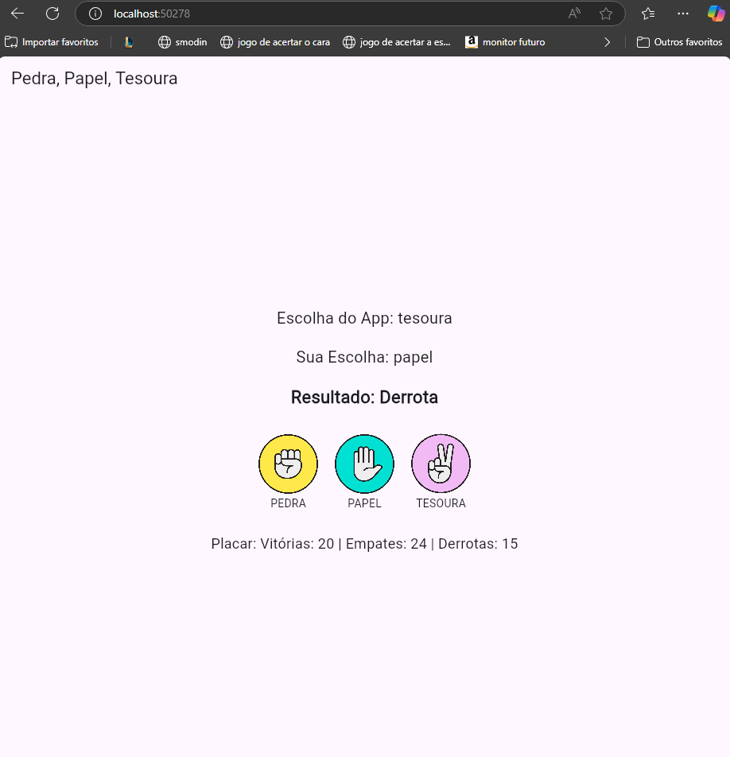
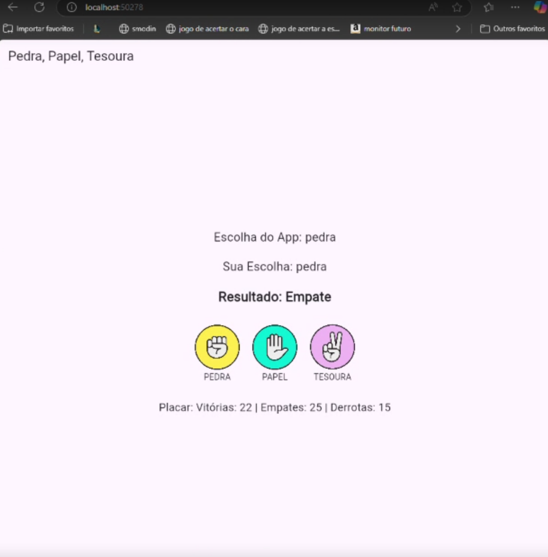
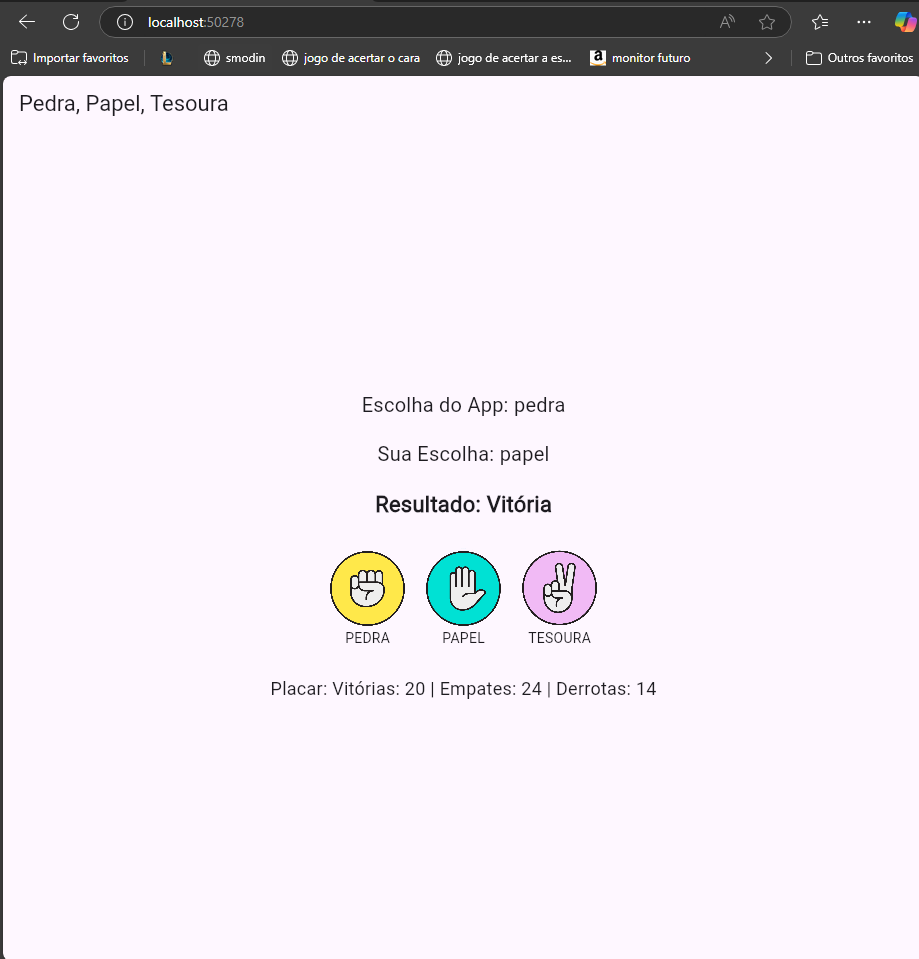

Jokenpo

Descrição do Aplicativo:

O jogo Pedra, Papel e Tesoura é um aplicativo desenvolvido em Flutter onde o usuário disputa contra o aplicativo. O objetivo é testar a sorte e estratégia do jogador ao escolher entre as três opções disponíveis. O jogo registra e exibe o placar de vitórias, derrotas e empates.

Componentes da Dupla

122100021

222100013

Captura de Tela do Aplicativo:

